# 🚀 KozoFlow: Intelligent Workforce & Code Quality Platform

> **Slogan:** *Seamless Work, Limitless Flow.*

---

## 📖 Executive Summary

KozoFlow is a unified AI platform designed to optimize **Hiring** and **Software Quality** at Kozocom. It acts as a central intelligence layer that ingests data from:

- **Recruitment CVs**
- **Code Review Logs**

These are stored in a structured **MySQL database**. A central **"Smart Integrator" (Chatbot)** uses **RAG (Retrieval-Augmented Generation)** to answer questions and connect these data sources — for example, finding candidates based on current code issues.

---

## 🏗️ System Architecture & Tech Stack

| Layer | Technology |
|-------|------------|
| **Frontend** | React.js (Vite), TailwindCSS, Axios (Standard HTTP) |
| **Backend** | Node.js, Express.js |
| **AI Service** | Python (FastAPI) - called via REST API |
| **Relational DB** | MySQL 8.0+ (with JSON column type for flexible data) |
| **Vector Store** | Pinecone |
| **LLM** | Ollama (Local) - llama3.1 |
| **Embeddings** | nomic-embed-text (via Ollama) |

### Architecture Diagram

```mermaid
flowchart TB
    subgraph Frontend["🖥️ Frontend (React.js)"]
        UI[User Interface]
        Charts[Analytics Dashboard]
        Chat[Smart Integrator Chat]
    end

    subgraph Backend["⚙️ Backend (Node.js/Express)"]
        API[REST API]
        Parser[CV Parser]
        Analyzer[Code Review Analyzer]
        Router[AI Router]
    end

    subgraph Database["🗄️ Database Layer"]
        MySQL[(MySQL 8.0+)]
        Pinecone[(Pinecone Vector DB)]
    end

    subgraph AI["🤖 AI Services (Local)"]
        Ollama[Ollama LLM]
        Embeddings[nomic-embed-text]
    end

    UI --> API
    Charts --> API
    Chat --> API
    
    API --> Parser
    API --> Analyzer
    API --> Router
    
    Parser --> MySQL
    Parser --> Embeddings
    Embeddings --> Pinecone
    Analyzer --> MySQL
    Router --> Ollama
    Router --> MySQL
    Router --> Pinecone
```



---

## 🌟 Feature Specifications (The 3 Pillars)

### 1. Module A: The Talent Scanner 📄

**Goal:** Parse CVs, extract skills, and rank candidates automatically.

#### Logic Flow


1. **Ingest:** Admin uploads PDF CV via API
2. **Analyze:** AI (Ollama) converts unstructured PDF text into structured JSON
3. **Save:** Store structured profile in the `candidates` table
4. **Vectorization:** Create embedding and save for semantic search

#### MySQL Schema

```sql
CREATE TABLE candidates (
    id BIGINT AUTO_INCREMENT PRIMARY KEY,
    name VARCHAR(255) NOT NULL,
    email VARCHAR(255),
    current_role VARCHAR(100),
    years_experience INT,
    skills JSON,                    -- ["React", "MySQL", "NodeJS"]
    raw_cv_text MEDIUMTEXT,
    match_score DECIMAL(5, 2),      -- Score relative to job context
    vector_id VARCHAR(255),         -- Reference to Pinecone/Vector ID
    created_at TIMESTAMP DEFAULT CURRENT_TIMESTAMP
);
```

---

### 2. Module B: Code Review Analytics 💻

**Goal:** Visualize code quality data to track developer performance and error trends.

#### Logic Flow


1. **Ingest:** Receive JSON payload from Code Review tool (Webhook/manual)
2. **Save:** Parse JSON and insert into `code_reviews` table
3. **Visualize:** Frontend fetches aggregated data for charts
4. **Analyze:** Smart Integrator uses data for performance questions

#### MySQL Schema

```sql
CREATE TABLE code_reviews (
    id BIGINT AUTO_INCREMENT PRIMARY KEY,
    developer_name VARCHAR(255),
    pr_link VARCHAR(255),
    review_date DATE,
    total_errors INT,
    error_types JSON,              -- {"syntax": 2, "logic": 5, "security": 1}
    reviewer_comments TEXT,
    created_at TIMESTAMP DEFAULT CURRENT_TIMESTAMP
);
```

---

### 3. Module C: The Smart Integrator (The "Brain") 🧠

**Goal:** Central Chatbot that queries all MySQL tables + Vectors to answer complex questions.

#### Logic Flow


#### Example Scenarios

| Question Type | Example | Action |
|---------------|---------|--------|
| **SQL Analytics** | "Who made the most security errors last week?" | Generate & execute SQL query |
| **Semantic Search** | "Find candidates with React experience" | Vector similarity search |
| **Cross-Module** | "Find a candidate who can fix our current errors" | Analyze errors → Search candidates |

#### Cross-Module Scenario Flow


---

## 🛠️ API Endpoints Guide (RESTful)

### 1. Talent API

| Method | Endpoint | Description |
|--------|----------|-------------|
| `POST` | `/api/candidates/upload` | Upload and parse CV |
| `POST` | `/api/candidates/search` | Semantic search for candidates |

#### Upload CV

```http
POST /api/candidates/upload
Content-Type: multipart/form-data

file: cv.pdf
```

**Action:** Parse PDF → Extract JSON → Insert to MySQL → Generate Vector

#### Search Candidates

```http
POST /api/candidates/search
Content-Type: application/json

{
  "job_description": "We need a Laravel developer with 3+ years experience..."
}
```

**Action:** Vector search for best matches

---

### 2. Review API

| Method | Endpoint | Description |
|--------|----------|-------------|
| `POST` | `/api/reviews/ingest` | Ingest code review data |
| `GET` | `/api/reviews/stats` | Get aggregated statistics |

#### Ingest Review Data

```http
POST /api/reviews/ingest
Content-Type: application/json

{
  "developer_name": "John Doe",
  "pr_link": "https://github.com/org/repo/pull/123",
  "review_date": "2025-01-04",
  "total_errors": 8,
  "error_types": {"syntax": 2, "logic": 5, "security": 1},
  "reviewer_comments": "Please fix the security vulnerability..."
}
```

#### Get Statistics

```http
GET /api/reviews/stats?period=week
```

**Response:** Aggregated data for frontend charts

---

### 3. Chat API

| Method | Endpoint | Description |
|--------|----------|-------------|
| `POST` | `/api/chat/query` | Ask the Smart Integrator |

#### Query Example

```http
POST /api/chat/query
Content-Type: application/json

{
  "message": "Who is the best React candidate?"
}
```

**Action:** AI Router → Execute SQL or Vector Search → Return Answer

---

## 📁 Project Structure

```
Kozocom-Flow/
├── kozocom-flow-frontend/     # React.js Frontend
│   ├── src/
│   │   ├── components/        # UI Components
│   │   ├── App.tsx            # Main App Component
│   │   └── index.ts           # Entry point
│   ├── styles/                # CSS Styles
│   └── package.json
│
├── kozocom-flow-backend/      # Node.js Backend
│   ├── src/                   # Source code
│   └── package.json
│
├── kozocom-flow-ai/           # AI Services
│
└── documents/                 # Project Documentation
```

---

## 🚀 Getting Started

### Prerequisites

- Node.js 18+ or Bun
- MySQL 8.0+
- Ollama installed locally ([Download Ollama](https://ollama.ai))
- ChromaDB (optional, for vector storage)

### Frontend Setup

```bash
cd kozocom-flow-frontend
bun install
bun start
```

### Backend Setup

```bash
cd kozocom-flow-backend
bun install
bun run dev
```

### Ollama Setup

```bash
# Install Ollama (Windows/Mac/Linux)
# Download from https://ollama.ai

# Pull required models
ollama pull llama3.1          # Main LLM for chat & analysis (supports native tool calling)
ollama pull nomic-embed-text  # Embeddings for RAG

# Start Ollama server (runs on http://localhost:11434)
ollama serve
```

### Environment Variables

Create `.env` file in backend:

```env
# Database
DB_HOST=localhost
DB_PORT=3306
DB_USER=root
DB_PASSWORD=your_password
DB_NAME=kozoflow

# AI Service (Python FastAPI)
AI_SERVICE_URL=http://localhost:6000

# Ollama (Local LLM - used by AI Service)
OLLAMA_BASE_URL=http://localhost:11434
OLLAMA_MODEL=llama3.1
OLLAMA_EMBED_MODEL=nomic-embed-text

# Pinecone (Vector Store)
PINECONE_API_KEY=your_pinecone_api_key
PINECONE_ENVIRONMENT=your_environment
PINECONE_INDEX_NAME=kozoflow-candidates
```

---

## 📊 Dashboard Features

### Code Review Analytics

- **Top Errors by Developer** - Bar chart showing error distribution
- **Weekly Bug Count** - Trend line of bugs over time
- **Error Type Breakdown** - Pie chart of error categories

### Talent Management

- **Candidate Ranking** - Sorted by match score
- **Skills Distribution** - Tag cloud of available skills
- **Experience Overview** - Histogram of years of experience

---

## 🔐 Security Considerations

| Area | Implementation |
|------|----------------|
| Authentication | JWT-based auth tokens |
| Data Encryption | HTTPS for all API calls |
| Input Validation | Sanitize all user inputs |
| Rate Limiting | Protect API from abuse |
| CORS | Restrict to known origins |

---

## 📐 Coding Standards & Best Practices

> *"Code is read more often than it is written."* — Guido van Rossum

### 1. General Principles

| Principle | Description |
|-----------|-------------|
| **KISS** | Keep It Simple, Stupid - Avoid over-engineering |
| **DRY** | Don't Repeat Yourself - Extract reusable code |
| **YAGNI** | You Aren't Gonna Need It - Don't add unused features |
| **SOLID** | Follow SOLID principles for maintainable code |

---

### 2. Naming Conventions

```typescript
// ✅ GOOD: Descriptive, clear names
const userAuthenticationToken: string = 'abc123';
const isUserLoggedIn: boolean = true;
const fetchCandidatesBySkills = async (skills: string[]) => { };

// ❌ BAD: Vague, abbreviated names
const uat: string = 'abc123';
const flag: boolean = true;
const getData = async (s: string[]) => { };
```

| Type | Convention | Example |
|------|------------|----------|
| Variables | camelCase | `userName`, `isActive` |
| Constants | UPPER_SNAKE_CASE | `MAX_RETRY_COUNT`, `API_BASE_URL` |
| Functions | camelCase (verb + noun) | `getUserById`, `validateEmail` |
| Classes | PascalCase | `CandidateService`, `ReviewAnalyzer` |
| Interfaces | PascalCase with 'I' prefix (optional) | `ICandidate`, `Candidate` |
| Files | kebab-case | `candidate-service.ts`, `review-utils.ts` |

---

### 3. Comment Guidelines

```typescript
/**
 * Parses a PDF CV and extracts structured candidate information.
 * Uses Ollama LLM for intelligent text extraction.
 * 
 * @param pdfBuffer - Raw PDF file buffer
 * @returns Structured candidate data with skills, experience, and contact info
 * @throws {PdfParseError} When PDF is corrupted or unreadable
 * 
 * @example
 * const candidate = await parseCvPdf(fileBuffer);
 * console.log(candidate.skills); // ['React', 'Node.js']
 */
export async function parseCvPdf(pdfBuffer: Buffer): Promise<CandidateData> {
  // Step 1: Extract raw text from PDF
  const rawText = await extractTextFromPdf(pdfBuffer);
  
  // Step 2: Use Ollama to structure the data
  // NOTE: Using llama3.2 for better JSON extraction
  const structuredData = await ollamaClient.chat({
    model: 'llama3.2',
    messages: [{ role: 'user', content: buildPrompt(rawText) }]
  });
  
  // Step 3: Validate and return
  return validateCandidateData(structuredData);
}
```

#### When to Comment:

| ✅ DO Comment | ❌ DON'T Comment |
|---------------|------------------|
| Complex business logic | Obvious code (`i++; // increment i`) |
| "Why" behind decisions | "What" the code does (self-documenting) |
| API/function documentation | Every single line |
| Edge cases & workarounds | Commented-out dead code |
| TODO/FIXME with ticket refs | TODO without context |

---

### 4. File Structure & Organization

```typescript
// ============================================================
// candidate.service.ts
// Description: Handles all candidate-related business logic
// Author: KozoFlow Team
// ============================================================

// ─────────────────────────────────────────────────────────────
// IMPORTS
// ─────────────────────────────────────────────────────────────
import { Injectable } from '@nestjs/common';
import { CandidateRepository } from './candidate.repository';
import { OllamaService } from '../ai/ollama.service';

// ─────────────────────────────────────────────────────────────
// TYPES & INTERFACES
// ─────────────────────────────────────────────────────────────
interface CandidateSearchParams {
  skills?: string[];
  minExperience?: number;
  role?: string;
}

// ─────────────────────────────────────────────────────────────
// CONSTANTS
// ─────────────────────────────────────────────────────────────
const MAX_SEARCH_RESULTS = 50;
const DEFAULT_MATCH_THRESHOLD = 0.75;

// ─────────────────────────────────────────────────────────────
// SERVICE CLASS
// ─────────────────────────────────────────────────────────────
export class CandidateService {
  // ... implementation
}
```

---

### 5. Error Handling

```typescript
// ✅ GOOD: Specific error types with context
export class CandidateNotFoundError extends Error {
  constructor(candidateId: string) {
    super(`Candidate not found: ${candidateId}`);
    this.name = 'CandidateNotFoundError';
  }
}

// ✅ GOOD: Proper try-catch with logging
async function getCandidateById(id: string): Promise<Candidate> {
  try {
    const candidate = await candidateRepository.findById(id);
    
    if (!candidate) {
      throw new CandidateNotFoundError(id);
    }
    
    return candidate;
  } catch (error) {
    // Log with context for debugging
    logger.error('Failed to fetch candidate', { 
      candidateId: id, 
      error: error.message 
    });
    throw error;
  }
}

// ❌ BAD: Generic catch-all with no context
async function getCandidateById(id: string) {
  try {
    return await repo.find(id);
  } catch (e) {
    console.log('error'); // No context!
  }
}
```

---

### 6. Function Guidelines

```typescript
// ✅ GOOD: Single responsibility, clear purpose
async function calculateCandidateMatchScore(
  candidate: Candidate,
  jobRequirements: JobRequirements
): Promise<number> {
  const skillScore = calculateSkillMatch(candidate.skills, jobRequirements.skills);
  const experienceScore = calculateExperienceMatch(candidate.years, jobRequirements.minYears);
  
  return (skillScore * 0.6) + (experienceScore * 0.4);
}

// ❌ BAD: Function doing too many things
async function processCandidate(data: any) {
  // Parsing, validating, saving, emailing, scoring all in one!
}
```

| Rule | Guideline |
|------|----------|
| **Max Lines** | Functions should be < 50 lines |
| **Parameters** | Max 3-4 parameters, use object for more |
| **Return Type** | Always explicit return types in TypeScript |
| **Single Purpose** | One function = one responsibility |

---

### 7. React Component Standards

```tsx
// ============================================================
// CandidateCard.tsx
// Description: Displays candidate summary in search results
// ============================================================

import React, { memo } from 'react';
import type { Candidate } from '@/types/candidate';

// ─────────────────────────────────────────────────────────────
// TYPES
// ─────────────────────────────────────────────────────────────
interface CandidateCardProps {
  /** The candidate data to display */
  candidate: Candidate;
  /** Callback when card is clicked */
  onSelect?: (id: string) => void;
  /** Whether this card is currently selected */
  isSelected?: boolean;
}

// ─────────────────────────────────────────────────────────────
// COMPONENT
// ─────────────────────────────────────────────────────────────
export const CandidateCard = memo(function CandidateCard({
  candidate,
  onSelect,
  isSelected = false,
}: CandidateCardProps) {
  // Event handlers
  const handleClick = () => onSelect?.(candidate.id);

  return (
    <div 
      className={`candidate-card ${isSelected ? 'selected' : ''}`}
      onClick={handleClick}
      role="button"
      tabIndex={0}
    >
      <h3>{candidate.name}</h3>
      <p>{candidate.currentRole}</p>
      <SkillTags skills={candidate.skills} />
    </div>
  );
});
```

---

### 8. Git Commit Standards

```bash
# Format: <type>(<scope>): <subject>

# Types:
feat:     # New feature
fix:      # Bug fix
docs:     # Documentation only
style:    # Formatting (no code change)
refactor: # Code restructure (no feature change)
test:     # Adding tests
chore:    # Maintenance tasks

# Examples:
git commit -m "feat(candidates): add skill-based search filter"
git commit -m "fix(reviews): correct weekly stats aggregation"
git commit -m "docs(api): update endpoint documentation"
git commit -m "refactor(chat): extract AI router logic"
```

---

### 9. Code Review Checklist

- [ ] **Readability**: Can a new developer understand this?
- [ ] **Naming**: Are names descriptive and consistent?
- [ ] **Comments**: Is the "why" explained for complex logic?
- [ ] **Error Handling**: Are errors caught and handled properly?
- [ ] **Tests**: Are there unit tests for new functionality?
- [ ] **Performance**: Any obvious performance issues?
- [ ] **Security**: No hardcoded secrets, SQL injection risks?
- [ ] **DRY**: Is there duplicated code that should be extracted?

---

## 📝 License

© 2025 Kozocom. All rights reserved.

---

## 🤝 Contributing

1. Fork the repository
2. Create your feature branch (`git checkout -b feature/amazing-feature`)
3. Commit your changes using [commit standards](#8-git-commit-standards)
4. Push to the branch (`git push origin feature/amazing-feature`)
5. Open a Pull Request
